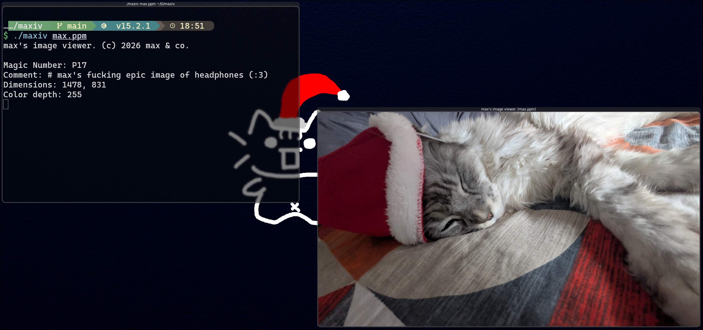

# maxiv (max image viewer)

this is just a bit of fun from me. this is **not** a serious project and was just done to mess about with the OpenPPN image format and SDL and whatnot.


# Usage
may it be noted that you can only open PNG files with this program. if you want to test this out but do not have them, use gimp to freely convert it. i shall warn you however that OpenPPN is an uncompressed file format. large images that were not already compressed with previous image types will be very large on your disk.

```./maxiv <path to file>```



